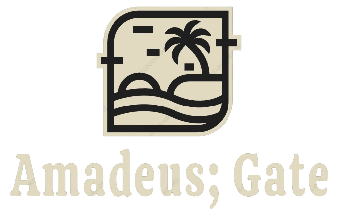
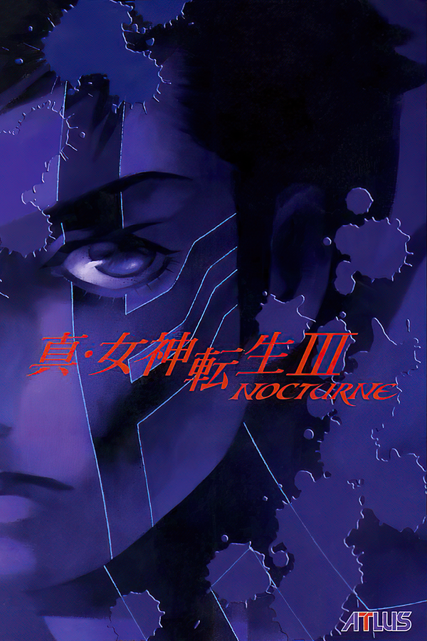
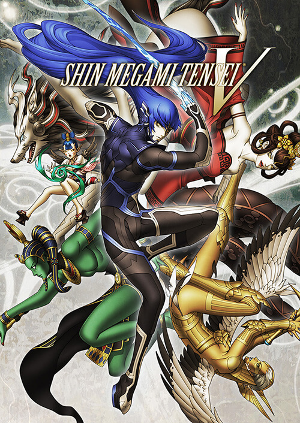

<!DOCTYPE html>
<html lang="ES">
    <head>
        <title>Prototipo</title>
        <meta charset="utf-8">
        <meta name="viewport" content="width=device-width, initial-scale=1">
        <link rel="stylesheet" href="https://cdn.jsdelivr.net/npm/bootstrap@4.6.2/dist/css/bootstrap.min.css">
        
        
        
        <link rel="stylesheet" href="styles.css">
    </head>
    <body>
        <!--===================Barra de Navegación===================-->
        <nav class="navbar navbar-expand-md navbar-dark">
            <a class="navbar-brand" href="#">
                
            </a>
            <button class="navbar-toggler" type="button" data-toggle="collapse" data-target="#navbarSupportedContent" aria-controls="navbarSupportedContent" aria-expanded="false" aria-label="Toggle navigation">
              
            </button>
          
                 

                    <ul class="navbar-nav ml-auto">
                        <li class="nav-item active">
                        <a class="nav-link" href="#">Home</a>
                        </li>
                        <li class="nav-item">
                        <a class="nav-link" href="#">Acerca de nosotros</a>
                        </li>
                        <li class="nav-item">
                            <a class="nav-link" href="#">Contacto</a>
                        </li>
                        <li class="nav-item">
                          <a class="nav-link" href="https://github.com/Amadeus-Gate/DM_Integral">Otras aplicaciones</a>
                      </li>
                  

                </li>
              </ul>
            

          </nav>
          <!--===================Banner===================-->
          

            

              

                <h1 class="mb-5 title">Nightmare of awakening</h1>
                
En "Nightmare of Awakening", te embarcarás en un aterrador viaje hacia los rincones más oscuros de la mente humana. Después de sobrevivir a un accidente automovilístico en una remota y nebulosa carretera, te despiertas en un mundo alterado, donde la realidad se entrelaza con los peores temores de tu subconsciente. ¿Podras sobrevivir?

                
                <!--Hipervinculo DEMO-->
                <a href="https://drive.google.com/file/d/19disGW8o5GQpQk3vPevHxwQiFtFSZSVM/view?usp=drive_link">
                <button class="btn btn-dark mt-5">¡Prueba nuestra DEMO!</button>
                </a>

              

            

          

          <!--===============Pagina principal===============-->
          <main>
            

              

                <h2>Nuestra empresa</h2>
                
En Amadeus;Gate, nos dedicamos a la creación de experiencias de juego excepcionales que transportan a jugadores a mundos imaginarios, desafiándolos a explorar, aprender y disfrutar. Nos esforzamos por fusionar la innovación tecnológica con la creatividad sin límites para ofrecer títulos que no solo entretienen, sino que también inspiran y conectan a la comunidad global de jugadores.

              

            
            <!--===============Acerca de nosotros===============-->
              

                

                  <h2>Acerca de nosotros</h2>
              

              <!--Misión y Visión-->
                

                  

                    

                      <h2>Misión</h2>
                      
Crear experiencias de entretenimiento inigualables a través de videojuegos innovadores que cautiven a jugadores de todas las edades. Nos esforzamos por ofrecer emociones, historias envolventes y calidad excepcional en cada uno de nuestros títulos, estableciendo así un vínculo duradero con nuestra comunidad de jugadores

                    

                    

                      <h2>Visión</h2>
                      
Ser reconocidos como líderes en la industria de los videojuegos, impulsados por la creatividad, la tecnología de vanguardia y la pasión por ofrecer experiencias de juego memorables. Aspiramos a ser pioneros en la creación de mundos virtuales que inspiren, conecten y desafíen a jugadores de todo el mundo, posicionándonos como referentes en la convergencia de la narrativa y la tecnología

                    

                  

                

                
                <!--Trailer dejuego-->
                

                  

                    <h2>¡Trailer de nuestro proximo proyecto!</h2>
                    <iframe width="500px" height="500px" src="https://www.youtube.com/embed/6bVIIr2gcD4" title="Nightmare of Awakening Trailer #1" frameborder="0" allow="accelerometer; autoplay; clipboard-write; encrypted-media; gyroscope; picture-in-picture; web-share" allowfullscreen></iframe>
                

                <!--===============Nuestros productos===============-->
                

                  

                    <h2>Nuestros productos</h2>
                

                <!--Producto 1-->
                

                    

                      

                        
                        

                          <h3>SMT III: Nocturne</h3>
                          
                        

                      

                    

                  <!--Producto 2-->
                    

                      

                        
                        

                          <h3>SMT IV: Apocalipsis</h3>
                        

                      

                    

                  <!--Producto 3-->
                  

                    

                      
                      

                        <h3>Shin Megami Tensei</h3>
                        
 

                      

                    

                  

                

          </main>
          <!--===============Contacto===============-->
          <!--===============Footer===============-->
          <footer class="text-light text-center py-3">
            

              

                <a href="#">Términos y Condiciones</a> | <a href="#">Aviso de Privacidad</a>
              

                &copy; Created by: Amadeus; Gate 2023
            

        </footer>
    </body>
</html>
